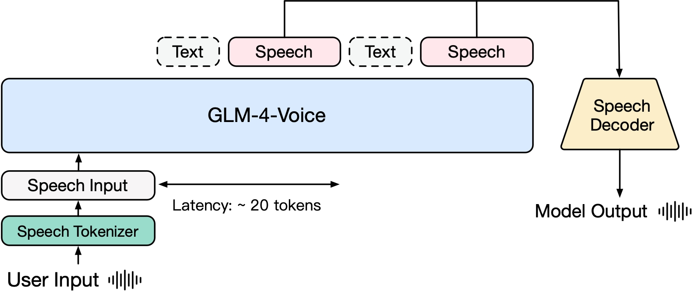
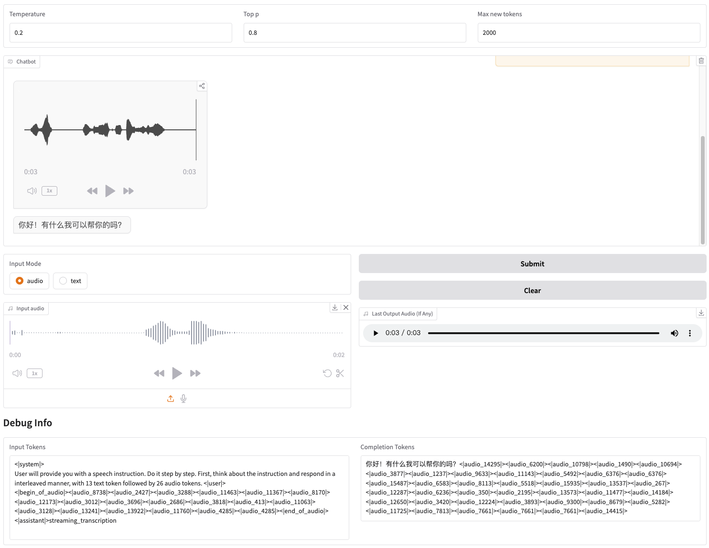

# GLM-4-Voice

GLM-4-Voice is an end-to-end voice model launched by Zhipu AI. GLM-4-Voice can directly understand and generate Chinese and English speech, engage in real-time voice conversations, and change attributes such as emotion, intonation, speech rate, and dialect based on user instructions.

## Model Architecture


We provide the three components of GLM-4-Voice:
* GLM-4-Voice-Tokenizer: Trained by adding vector quantization to the encoder part of [Whisper](https://github.com/openai/whisper), converting continuous speech input into discrete tokens. Each second of audio is converted into 12.5 discrete tokens.
* GLM-4-Voice-9B: Pre-trained and aligned on speech modality based on [GLM-4-9B](https://github.com/THUDM/GLM-4), enabling understanding and generation of discretized speech.
* GLM-4-Voice-Decoder: A speech decoder supporting streaming inference, retrained based on [CosyVoice](https://github.com/FunAudioLLM/CosyVoice), converting discrete speech tokens into continuous speech output. Generation can start with as few as 10 audio tokens, reducing conversation latency.

A more detailed technical report will be published later.

## Model List

|         Model         |       Type       |                               Download                               |
|:---------------------:|:----------------:|:--------------------------------------------------------------------:|
| GLM-4-Voice-Tokenizer | Speech Tokenizer | [🤗 Huggingface](https://huggingface.co/THUDM/glm-4-voice-tokenizer) |
|    GLM-4-Voice-9B     |    Chat Model    |    [🤗 Huggingface](https://huggingface.co/THUDM/glm-4-voice-9b)     |
|  GLM-4-Voice-Decoder  |  Speech Decoder  |  [🤗 Huggingface](https://huggingface.co/THUDM/glm-4-voice-decoder)  |

## Usage
We provide a Web Demo that can be launched directly. Users can input speech or text, and the model will respond with both speech and text.



### Preparation

First, download the repository
```shell
git clone --recurse-submodules https://github.com/THUDM/GLM-4-Voice
cd GLM-4-Voice
```
Then, install the dependencies. You can also use our pre-built docker image `zhipuai/glm-4-voice:0.1` to skip the step.
```shell
pip install -r requirements.txt
```
Since the Decoder model does not support initialization via `transformers`, the checkpoint needs to be downloaded separately.

```shell
# Git model download, please ensure git-lfs is installed
git clone https://huggingface.co/THUDM/glm-4-voice-decoder
```

### Launch Web Demo

1. Start the model server

```shell
python model_server.py --host localhost --model-path THUDM/glm-4-voice-9b --port 10000 --dtype bfloat16 --device cuda:0
```

If you need to launch with Int4 precision, run

```shell
python model_server.py --host localhost --model-path THUDM/glm-4-voice-9b --port 10000 --dtype int4 --device cuda:0
```

This command will automatically download `glm-4-voice-9b`. If network conditions are poor, you can manually download it and specify the local path using `--model-path`.

2. Start the web service

```shell
python web_demo.py --tokenizer-path  THUDM/glm-4-voice-tokenizer --model-path THUDM/glm-4-voice-9b --flow-path ./glm-4-voice-decoder
```

You can access the web demo at [http://127.0.0.1:8888](http://127.0.0.1:8888).
This command will automatically download `glm-4-voice-tokenizer` and `glm-4-voice-9b`. Please note that `glm-4-voice-decoder` needs to be downloaded manually.
If the network connection is poor, you can manually download these three models and specify the local paths using `--tokenizer-path`, `--flow-path`, and `--model-path`.

### Known Issues
* Gradio’s streaming audio playback can be unstable. The audio quality will be higher when clicking on the audio in the dialogue box after generation is complete.

